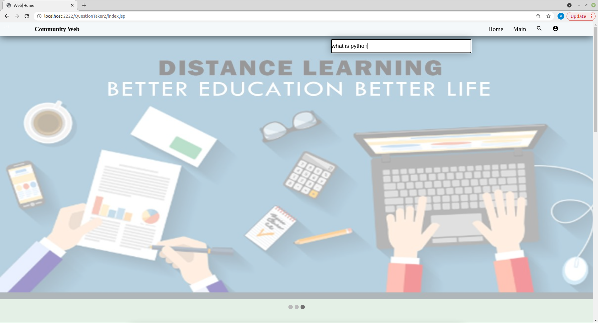

# Community-Web
<i>
  <h3>Introduction</h3>
  

    Community web is a question/answer site for the people or we say that community web is a duet of search engine and social media network, but its main purpose is to give you the answers and allow you to answer the questions asked by others of subjects in which you are knowledgeable. On Community Web, registered users can post questions, answer posted questions, and comment on questions and answers by other users, which can then be viewed by anyone.
     
The website serves as a platform for users to ask questions and answer and though membership and active participation to vote questions and answers up and down and edit questions and answers in a fashion. In our websites community web users earns credit points for example a user awarded with some points for receiving an up vote on a question and also for answer of any question. Our website group all the questions which are belong to same field or have same criteria so that you will find all relatable answers at a place. It’s an easy shuffle through all the discussions at a place so we save our time without surfing more on the google/internet. 
  

  <h3> Objective</h3>
  <ul>
    <li>To create a platform which will help clear the doubts which are of immediate basis.</li>
    <li>When there is an error in coding or any difficulty in any problem it will help you to resolve it.</li>
    <li>Accumulating Knowledge</li>
  </ul>
  <h3>Problem Statements & Solution Approach</h3>
    <ul>
      <li><strong>Dispersive:</strong> When we want to know any information about answer to our questions/query we just google it. But that information is distributed in many articles or even in many webpages. It is so time consuming to cover all this webpage’s information. About that information we have probability that the answer or information we get from the google is correct one. Maybe it is false. It is a big problem for the user.</li>
       Our platform serves as the solution for this problem by allowing one to get the answers and related knowledge on a single platform without being wandering on various websites and going through numerous articles, it can also serve the purpose of doubt solving and problem-solving platform as well.
      <li><b>Absence of collective association:</b> Although one can interact people by asking questions and replying to their answers but still it is a too discrete way of discussing something with varied opinions by different people, which lakes communal interaction or collective association on a general platform as a whole which in turn lakes in depth analysis for maybe of some topic and also lakes healthy interaction may or may not between like-minded individuals.</li>
       Our platform allows the people to create groups/community or to join them so that they can interact in a more of healthy and detailed way on the problem which serves the group and not just aimlessly posting answers which do not serve the greater good for the problem at hand.
      <li><b>More of social media:</b> In the current scenario we see that social media cover a lot of part of internet and our life also. In many webpages we see the content of social media which affect the effective information which they have. To cover the content of social media many websites forget their Aim. Webpages usually become cluttered with unnecessary posts and get wander of their main purpose.</li>
       Community web will serve and solve the purpose of this problem by not allowing people to post unnecessary stuff like social media posts, obscene content or comments etc. people can report for these types of posts if they do not like it by filling up a form and if the verdict comes to be righteous the post will be deleted as soon as possible and a warning is sent the post author thereby maintaining the decorum of the platform.
      <li><b>No liberty of selecting specific:</b> People write their question on the website but they are public which means that everyone can see it. A user has no liberty or leverage of choosing who we can show his question to which can sometimes can became of a sensitive issue if the asked question is the one for example referring to religion or communal rights, so which ultimately states that one can’t ask his questions to selected people i.e., private on other platforms.</li>
       This problem can be solved by enabling a private key option which allow users to choose the other users or groups which he likes to send the post for an answer through an email but the identity and other details of selected users still remain hidden as the user can only choose other users through his alias name.
    </ul>
   
<h3> Hardware System Specification</h3>
  <ul>
    <li>Intel Pentium 4 or later</li>
    <li>2 Gb RAM</li>
    <li>Operating system (Windows10 / Linux)</li>
  </ul>
  <h3> Software System Specification</h3>
  <ul>
    <li>Netbeans IDE</li>
    <li>Hibernate 5.1 jar</li>
    <li>MySQL Connector jar</li>
    <li>Apache</li>
  </ul>
  <h3>Technologies Used</h3>
  <ul>
    <li>HTML & CSS</li>
    <li>JSP</li>
    <li>JavaScript</li>
    <li>ORM</li>
  </ul>
  <h3>ER Diagram</h3>
  
  <h3>USE case Model</h3>
  
  <h3>Activity Diagram</h3>
  
  <h3>DFD Level-0</h3>
  
  <h3>DFD Level-1</h3>
  
<h3>DFD Level-2</h3>
  

<h3>Limitations</h3>
  <ul>
    <li>If a user posts a question, it is not known that after how much time he will get his response and whether it will be received or not is not confirmed.</li>
    <li>If a user posts a question, it will not be edited or deleted directly by the user.</li>
    <li>We cannot post questions through multimedia like in the form of photo, poster, video or audio.</li>
    <li>User can't see what all questions user following.</li>
    <li>User can't see all the answers which user liked or commented upon.</li>
  </ul>
  <h3>Future Enhancement</h3>
  <ul>
    <li>We will add another feature of social media in which user can know current affairs and daily news.</li>
    <li>We will be able to ask questions through multimedia.</li>
    <li>We will create a function in which companies can post their promises.</li>
  </ul>
<h3>Project Screenshots</h3>
  <ul>
    <li> </li>
    <li> </li>    
    <li> </li>    
    <li> </li>    
    <li> </li>   
    <li> </li>   
    <li> </li>
    <li> </li>   
    <li> </li>   
    <li> </li>    
    <li> </li>    
    <li> </li>  
    <li> </li>  
    <li> </li>  
    <li> </li>
  </ul>
